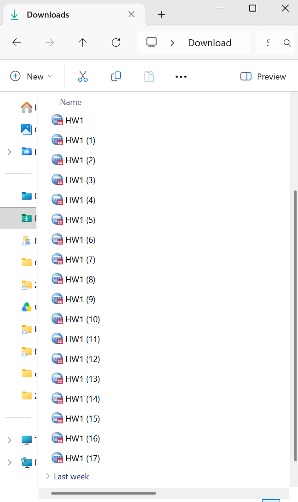
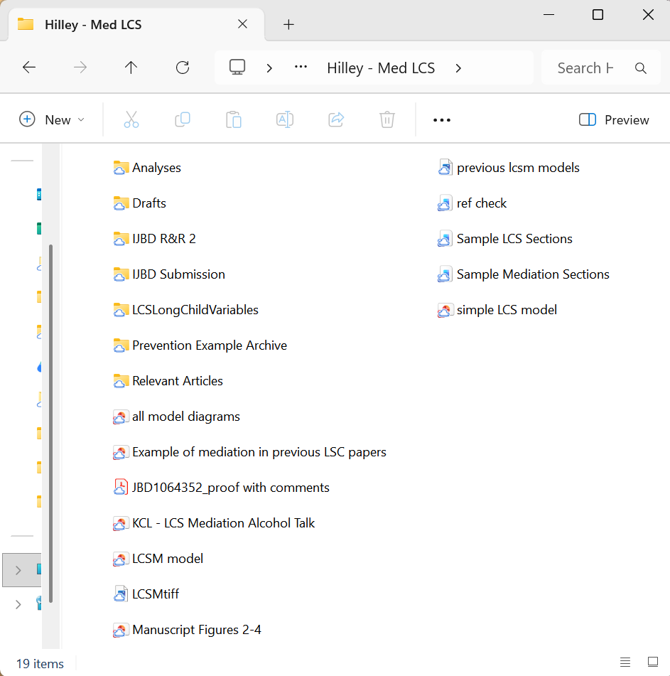
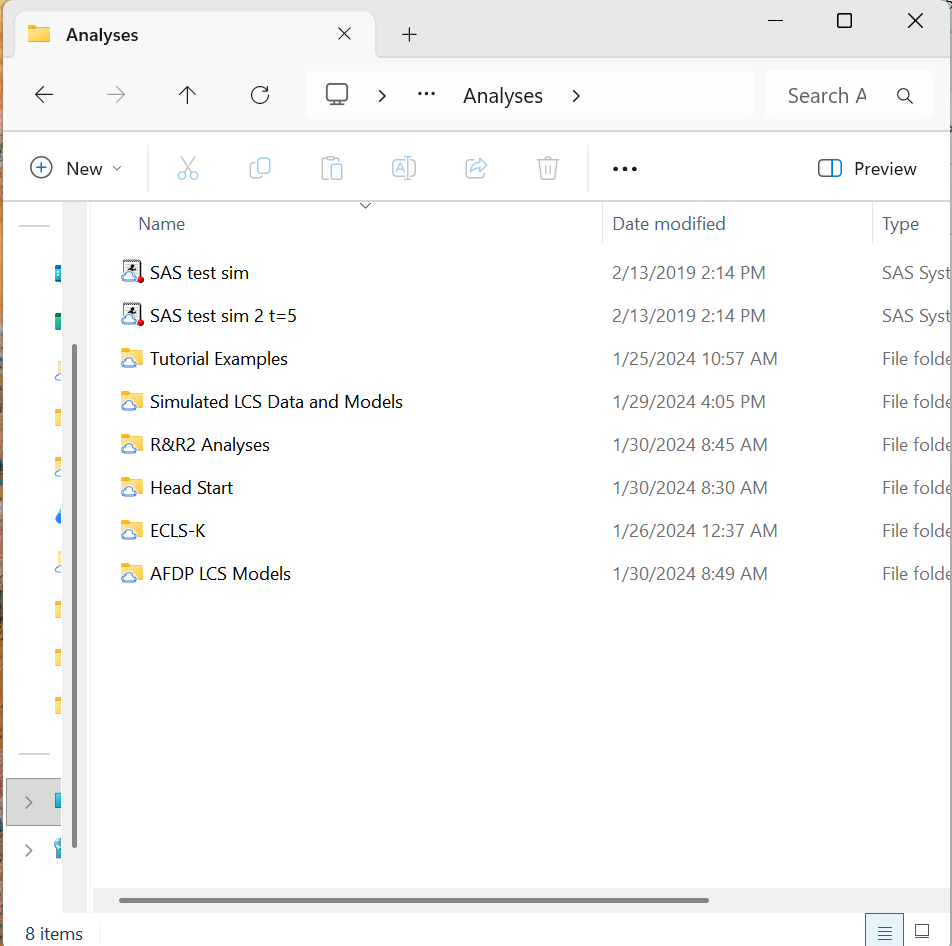
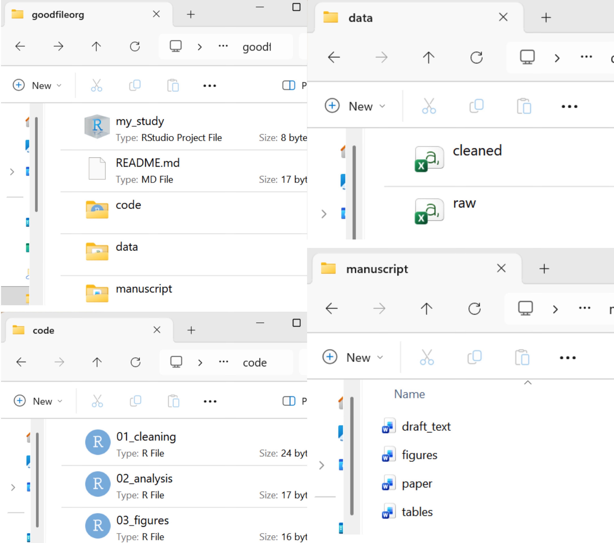
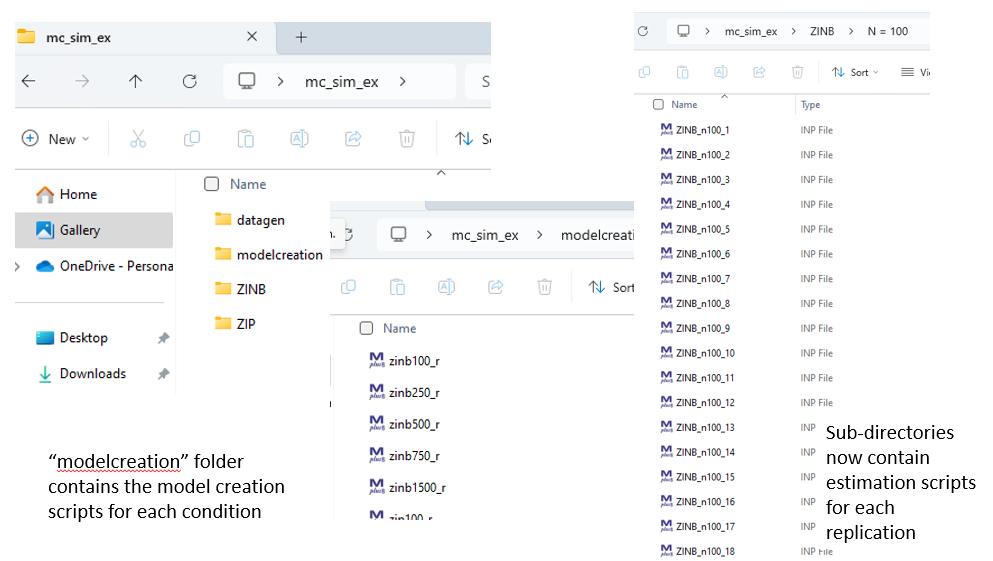
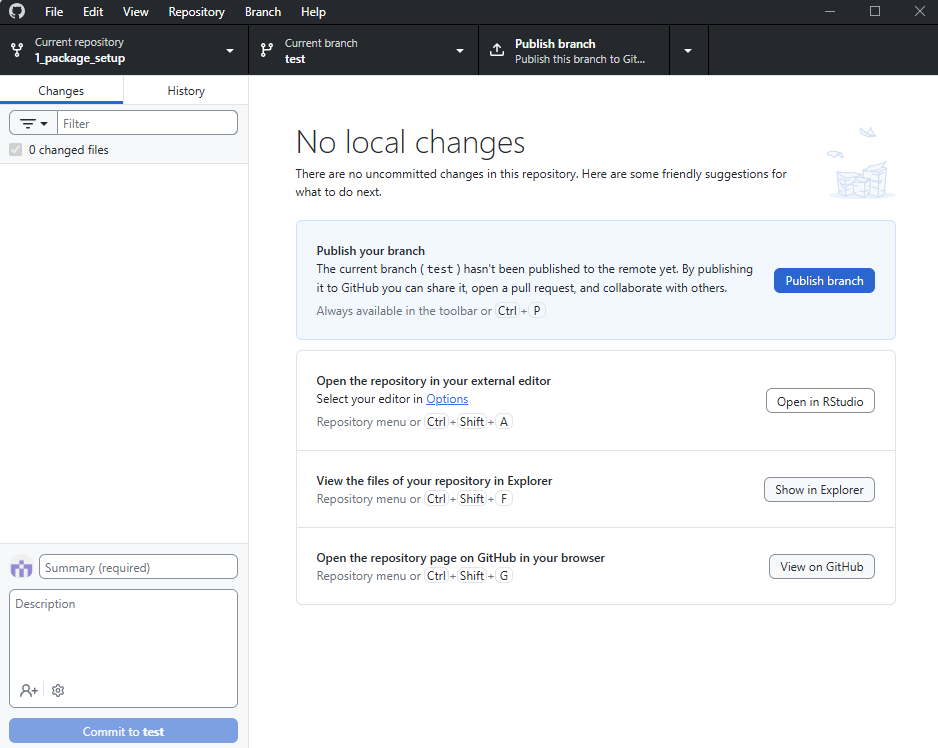

```{r xaringanExtra, echo=FALSE}
xaringanExtra::use_xaringan_extra(c("tile_view","broadcast"))
```

```{r xaringan-themer, include=FALSE, warning=FALSE}
# Set up custom theme
library(xaringanthemer)
style_mono_accent(
  base_color = "#1c5253",
  header_font_google = google_font("Josefin Sans"),
  text_font_google   = google_font("Montserrat", "300", "300i"),
  code_font_google   = google_font("Fira Mono"),
  base_font_size = "18px",
  text_font_size = "1.5rem",
  header_h1_font_size = "3rem",
  header_h2_font_size = "2.5rem",
  header_h3_font_size = "2rem",
  text_slide_number_color = "#1c5253",
  text_slide_number_font_size = "0.9em",
  padding = "6px 36px 6px 36px",
  extra_css = list(
    ".remark-slide-content h1" = list("margin-bottom" = "0.3em"),
    ".pull-left"  = list(width = "49%"),
    ".pull-right" = list(width = "49%"),
    ".col-text" = list(float = "left",  width = "30%"),
    ".col-img"  = list(float = "right", width = "68%"),
    ".col-img ~ *" = list(clear = "both")   # keeps later content below the columns
  )
)
```

```{r, include = F}
# This is the recommended set up for flipbooks
# you might think about setting cache to TRUE as you gain practice --- building flipbooks from scratch can be time consuming
knitr::opts_chunk$set(fig.width = 6, message = FALSE, warning = FALSE, comment = "", cache = F)
library(flipbookr)
library(tidyverse)
#devtools::install_github("gadenbuie/xaringanExtra")
#remotes::install_github("mitchelloharawild/icons")
library(icons) #https://fontawesome.com/v5.15/icons?d=gallery&p=2&m=free
```

# Outline for Today

- File organization and naming conventions
  * Absolute and relative paths

- Importing CSV files
  * Importing single and multiple files
 
- Useful importing capabilities

- Other data import packages

.content-box-blue[
`r icons::fontawesome("github")` Follow along from this week's [Github repo](https://github.com/2026-PSYC-259/2-fileorg-importing)
]
.footnote[.small[.bold[Last updated: `r Sys.Date()`]]]

---
class: inverse, center, middle
# Part 1: File Organization and Naming
---

# File Organization: Why is it Important?

.pull-left[
- How you structure the directories for a project

- Very often ignored, but essential for an efficient workflow

- Benefits:

  - Faster retrieval (prevents "losing" items)
  - Better data security (prevents accidental access or deletion)
  - Fewer errors (prevents duplicate work, accidental overwriting)
]

.pull-right[
```{r, echo=FALSE, out.width="55%", fig.align="center"}

```
]

---

# File Organization: Directories

- Directories: Where your files "live" 

  - **Local**: They live on your machine
    
      - /Users/jonah/Desktop
  
  - **Cloud**: They live on a remote server hosted by a third party
    
      - /Users/jonah/Library/CloudStorage/GoogleDrive-jonahf@gmail.com

- Always maintain **local** directories when using git and Github

- We can use simple R code to create directories as well:
    - `if (!dir.exists("data_cleaned")) dir.create("data_cleaned")` 

---

# BAD File Organization

Why is this bad? Would you know where to find the data and analyses for the published paper?

.pull-left[
```{r, echo=FALSE, out.width="80%", fig.align="center"}

```
]

.pull-right[
```{r, echo=FALSE, out.width="80%", fig.align="center"}

```
]

---

# GOOD File Organization
.pull-left[
```text
goodfileorg/
├── README.md
├── my_study.Rproj
├── code/
│   ├── 01_clean_data.R
│   ├── 02_analysis.R
│   └── 03_figures.R
├── data/
│   ├── raw.csv
│   └── processed.csv
└── manuscript/
    ├── draft_text.docx
    ├── figures.docx
    └── tables.docx
```
]

.pull-right[
```{r, echo=FALSE, out.width="115%", fig.align="center"}

```
]

---

# Absolute vs. Relative File Paths

- This is a major consideration for our studies due to data privacy/IRB requirements

- Data are often stored with secure mapped drives that lead to different, machine-specific **absolute** file paths
  - Ex. Jonah's data is stored at /Users/jonah/UniversityDrive/IRB_Study_123/participant_data.csv
  - Liz's data is stored at /Users/lizdiaz/SecureResearch/IRB_Study_123/participant_data.csv

- You probably are familiar with using absolute file paths to import data in R 

- With RStudio Projects, we can use only **relative** paths to ensure the code works for everyone on the project
  - Ex. data/participant_data.csv is the reference for everyone in the R code
  - More on this in a bit...

---

# Naming Conventions

- How you name your files within a single subdirectory

- An ideal naming schema has three desirable properties:

  1. Machine readable

  2. Human readable

  3. Can be "default" sorted

---

# Machine Readable

- Use Latin alphabet letters (abc), Arabic numerals (123), alphanumeric only (no special characters)

- Add leading zeros based on your expected count (ex. n = 200 -> 001, 002... 200)

- Spacing options: 
  - Underscores (snake_case)
  - Capital letters (CamelCase)
  - Hyphens (kebab-case)
  - No spaces or special characters

- Choose case sensitivity wisely! 
  - R is a case-sensitive language and uses snake_case for naming

- `Jonah's Data.csv` -> ?

---

# Human Readable

- Consistency is key
  - Ex. Choose snake case and use it for ALL files in a project (scripts, data, etc.)

- File names should be concise, but detailed enough that another person can understand
  - Leave out unnecessary info like software 
  - Ex. "Jonah's R Data Cleaning Script.R" -> "data_cleaning.R"

- Document your naming convention in a README file
  - Your future self and collaborators will thank you!

---

# Default Sorting

- Before you start your workflow, decide on a sorting system that will make it easy for you to access your files with code

- Two typical sorting systems for prefixes:
  - Chronological
      - 2026-01-01_id001_task1.csv
      - 2026-01-01_id002_task1.csv
      - 2026-01-03_id001_task1.csv
  - Logical
      - 01_cleaning.R
      - 02_analysis.R 
      - 03_figures.R
  
- You can also use version numbers as suffixes (when needed)
  - Ex. V01, V02, V03, etc. (instead of final, final_final, final_forreal)

---

# Bad vs. Good Naming Conventions

```{r badnames-setup, include = FALSE}
bad_data <- data.frame(
  x = c(23, 31, 27),
  y = c(14, 21, 17),
  a = c(19, 22, 20),
  g = c("F", "M", "F"),
  t = c(1, 0, 1),
  s1 = c(7, 4, 9),
  s2 = c(12, 18, 15)
)
```

```{r badnames, echo = TRUE}
print(bad_data)
```

```{r goodnames-setup, include = FALSE}
good_data <- data.frame(
  participant_age = c(23, 31, 27),
  depression_score = c(14, 21, 17),
  anxiety_score = c(19, 22, 20),
  gender = c("F", "M", "F"),
  therapy_currently = c(1, 0, 1),
  pretest_score = c(7, 4, 9),
  posttest_score = c(12, 18, 15)
)
```

```{r goodnames, echo = TRUE}
print(good_data)
```

---

# Complex Naming Schema Example

```{r, echo=FALSE, out.width="88%", fig.align="center"}

```

---
class: inverse, center, middle
# Part 2: Importing Data
---

# Where does R look for files?

- **Working directory**: The folder R is currently "working" from 

- A **relative** path starts from the working directory
  * Ex. `data_raw/vocab16.csv`

- An **absolute** path starts from the root of the drive
  * Ex. `/Users/jonah/project/data_raw/vocab16.csv`

```r
getwd()       # Where is R looking right now?
list.files()  # What files can R see from the getwd() directory?
```
- We need to make sure that the working directory contains the files for our current project
---

# RStudio Projects set the working directory for you

- Opening the `.Rproj` file sets the working directory to the project folder

- Everyone who opens it gets the **same** starting point, so the same relative paths work on every machine

- Let's check this out with the repository we forked last week
  * The "1_package_setup" repo has both `.R` and `.Rproj` files

---

class: inverse, center, middle
# Quick Tutorial
---

# Step 1: Open the project on your local machine

.pull-left[
- Open GitHub desktop 

- Select "1_package_setup" as current repository

- Select "Open in RStudio"
]

.pull-right[
```{r, echo=FALSE,  out.width="115%", fig.align="center"}

```
]

---

# Step 2: Relative paths with the 'here' package

.pull-left[
- `here()` finds the project root from the `.Rproj` file and builds paths from it

- Everyone writes the same line of code, `here()` makes it work on any machine

- Open a new R script to try it out

- Compare with your neighbor; what do you see?
]

.pull-right[
```r
# install.packages("here") if needed
library(here)

# the project root
# absolute, differs per computer
here()      

# root + file name
here("package_install.Rproj")     

# TRUE from any folder in the project
file.exists(here("package_install.Rproj"))  
```
]

--

.content-box-blue[
Different computers print different roots, but `here("package_install.Rproj")` is the same code for both
]

---

# Data Importing: Base R and tidyverse

- Base R refers to the built-in functions in R

- tidyverse is a collection of packages that are specifically developed for data cleaning and visualization
  - Ex. dplyr, readr, ggplot2, tidyr, etc.
  - install.packages("tidyverse")

- Either method can be used for data cleaning and visualization, tidyverse can sometimes be more efficient
 
---

# Importing a CSV File

.pull-left[
- read.csv is base R, read_csv is tidyverse (readr package)

  - read_csv is faster

  - read_csv makes fewer assumptions about your data

  - read_csv can combine multiple data files into one
]

.pull-right[
The following examples use .csv (comma separated value) files in the data_raw directory
```{r, echo=FALSE, out.height="400px", fig.align="center"}
knitr::include_graphics("dir.png")
```
]
---
`r chunk_reveal("functions", break_type = "auto", widths = c(4, 1))`

```{r functions, include = FALSE}
# read.csv is part of base R, the default fx set
ds <- read.csv('data_raw/vocab16.csv')
print(ds)

# Let's load the readr package to use read_csv
library(readr) #for read_csv
ds <- read_csv('data_raw/vocab16.csv')
print(ds)
```

- "tibble" is a tidyverse data frame (keeps data frames predictable in tidyverse)
---
`r chunk_reveal("import_sequential", break_type = "auto", widths = c(2, 1))`

```{r import_sequential, include = FALSE}
# We can use read_csv to read individual files
ds12 <- read_csv('data_raw/vocab12.csv')
print(ds12)

ds12.5 <- read_csv('data_raw/vocab12.5.csv')
print(ds12.5)

ds13.5 <- read_csv('data_raw/vocab13.5.csv')
print(ds13.5)

# bind_rows can append tibbles together
# functionally merges the three data frames by column
ds_all <- bind_rows(ds12, ds12.5, ds13.5)
print(ds_all)
```

---
# But imagine having to read in every file in the list with separate read_csv commands...

.scroll-box-16[
```{r R.options = list(width = 75)}
#function for listing files a directory
list.files('data_raw', full.names = TRUE) 
```
]
---

`r chunk_reveal("import_multiple", break_type = "auto", float = "none", widths = c(5, 1))`

```{r import_multiple, include = FALSE}
# read_csv can import multiple files all at once!

# Create object that stores all the file names and directories
full_file_names <- list.files('data_raw', full.names = TRUE)

# Pass the names to read_csv to read all of them into a single tibble
ds_all <- read_csv(full_file_names)
print(ds_all)
```

---

# Why did we need full.names? 
.pull-left[
- `list.files('data_raw')` gives `vocab12.csv`, `vocab12.5.csv`... which are only the file names

- `list.files('data_raw', full.names = TRUE)` gives the relative path including the directory:

`data_raw/vocab12.csv`, `data_raw/vocab12.5.csv`
]

.pull-right[

]

---

# fs Package

- We can use the fs package to have more control over what we see of files

- dir_ls(): List files with location

- path_file(): Extract file names from a path string

- path_ext_remove(): Remove the final file extension from a filename

- path_abs(): Show absolute version of a given file path

---

`r chunk_reveal("fs", break_type = "rotate", float = "none", widths = c(5, 1))`

```{r fs, include = FALSE}
# Use the fs package to have more control over files
# install.packages("fs") if needed

library(fs)
files <- dir_ls("data_raw")
print(files) #ROTATE
print(path_file(files)) #ROTATE
print(path_ext_remove(path_file(files))) #ROTATE
print(path_abs(files)) #ROTATE
```
---

`r chunk_reveal("tibble", break_type = "auto", widths = c(1.5, 1))`

```{r tibble, include = FALSE}
# Let's add some things and write a combined output

# Create a new column in a dataset
ds_all$ppt_name <- "Jonah"

# Create a calculated column
ds_all$age_round <- round(ds_all$age)

# See the results
print(ds_all)

# Create the data_cleaned directory if it doesn't exist yet
if (!dir.exists("data_cleaned")) dir.create("data_cleaned")

# Let's export the combined data as a new dataset

write_csv(ds_all, file = "data_cleaned/vocab_combined.csv")
```

---

# Useful readr read_csv() capabilities

- Important read_csv() arguments:
  * `col_names = TRUE` (reads column names from first line by default)
  * `col_names = FALSE` (treats the first line as data)
  * `col_names = c("col1name", "col2name")` (to specify the names)
  * `col_types = NULL` (by default, guesses the data type)
  * `col_types = "ccDin"` (specify types character/date/integer/number)
  * `skip = 10` (skip the first 10 lines)

- Can also be used with read_tsv() (tab-delimited), read_delim() (character-delimited, general)

- write_csv(), write_tsv(), write_delim() export/save data

---

`r chunk_reveal("read_options", break_type = "rotate", float = "none", widths = c(5, 1))`

```{r read_options, include = FALSE}
fname <- "data_cleaned/vocab_combined.csv"
colname <- c("AGE", "WORD", "NAME", "MONTH")
coltypes <- "cccc"
ds <- read_csv(file = fname) #ROTATE
ds <- read_csv(file = fname, col_names = FALSE) #ROTATE
ds <- read_csv(file = fname, col_names = colname) #ROTATE
ds <- read_csv(file = fname, col_names = colname, skip = 1) #ROTATE
ds <- read_csv(file = fname, col_names = colname, skip = 1, col_types = coltypes) #ROTATE
print(ds)
```

---
# More Resources

- tidyverse data import "cheatsheets"

- Read the documentation: `?read_csv`, `?write_csv`

- specialized import packages
  * `haven` for SPSS/Stata/SAS
  * `readxl` for .xlsx
  * `googlesheets4` for Google sheets

---
class: center, middle
background-image: url("readr-cheatsheet1.png")
background-size: contain

---
class: center, middle
background-image: url("readr-cheatsheet2.png")
background-size: contain

---
# Data Import Homework Assignment

- Use the GitHub repo link below to clone the project (no need to fork) to your own user account and then to work locally on your own computer.

- Be sure you are using R version >= 4.0 and readr version >= 2.0

- The homework will make sure you learned what we covered, and will also ask you to try out new things to extend your knowledge

- Push your answers to a public Github repo, and turn in the homework by entering the link to the repo on Canvas

.content-box-blue[
`r icons::fontawesome("github")` Homework [Github repo](https://github.com/2026-PSYC-259/2-fileorg-importing-hw)
]

<!-- adjust font size in this css code chunk, currently 80 -->

```{css, eval = TRUE, echo = FALSE}
.remark-code{line-height: 1.5; font-size: 70%}

@media print {
  .has-continuation {
    display: block;
  }
}

code.r.hljs.remark-code{
  position: relative;
  overflow-x: hidden;
}

.remark-slide-number {
  opacity: 1; /* default: 0.5 */
}

.content-box { 
    box-sizing: border-box;
    background-color: #e2e2e2;
}
.content-box-blue,
.content-box-gray,
.content-box-grey,
.content-box-army,
.content-box-green,
.content-box-purple,
.content-box-red,
.content-box-yellow {
  box-sizing: border-box;
  border-radius: 15px;
  margin: 0 0 15px;
  overflow: hidden;
  padding: 0px 20px 0px 20px;
  width: 100%;
}
.content-box-blue { background-color: #F0F8FF; }
.content-box-gray { background-color: #e2e2e2; }
.content-box-grey {	background-color: #F5F5F5; }
.content-box-army {	background-color: #737a36; }
.content-box-green { background-color: #d9edc2; }
.content-box-purple { background-color: #e2e2f9; }
.content-box-red { background-color: #ffcccc; }
.content-box-yellow { background-color: #fef5c4; }
.content-box-blue .remark-inline-code,
.content-box-blue .remark-inline-code,
.content-box-gray .remark-inline-code,
.content-box-grey .remark-inline-code,
.content-box-army .remark-inline-code,
.content-box-green .remark-inline-code,
.content-box-purple .remark-inline-code,
.content-box-red .remark-inline-code,
.content-box-yellow .remark-inline-code { 
  background: none;
}

.scroll-box-8 {
  height:8em;
  overflow-y: scroll;
}
.scroll-box-10 {
  height:10em;
  overflow-y: scroll;
}
.scroll-box-12 {
  height:12em;
  overflow-y: scroll;
}
.scroll-box-14 {
  height:14em;
  overflow-y: scroll;
}
.scroll-box-16 {
  height:16em;
  overflow-y: scroll;
}
.scroll-box-18 {
  height:18em;
  overflow-y: scroll;
}
.scroll-box-20 {
  height:20em;
  overflow-y: scroll;
}
.scroll-output {
  height: 90%;
  overflow-y: scroll;
}
}

/************************
 * Font size and colours
 ************************/

/*      LaTeX style       */
.Large       , .Large .remark-code, .Large .remark-inline-code { font-size: 144%; }
.large       , .large .remark-code, .large .remark-inline-code { font-size: 120%; }
.small       , .small .remark-code, .small .remark-inline-code { font-size: 90%; }
.footnotesize, .footnotesize .remark-code, .footnotesize .remark-inline-code { font-size: 80%; }
.scriptsize  , .scriptsize .remark-code, .scriptsize .remark-inline-code { font-size: 70%; }
.tiny        , .tiny .remark-code, .tiny .remark-inline-code { font-size: 60%; }

/* or you can be more specific */
.font10 , .code10 .remark-code, .code10 .remark-inline-code{ font-size: 10%; }
.font20 , .code20 .remark-code, .code20 .remark-inline-code{ font-size: 20%; }
.font30 , .code30 .remark-code, .code30 .remark-inline-code{ font-size: 30%; }
.font40 , .code40 .remark-code, .code40 .remark-inline-code{ font-size: 40%; }
.font50 , .code50 .remark-code, .code50 .remark-inline-code{ font-size: 50%; }
.font60 , .code60 .remark-code, .code60 .remark-inline-code{ font-size: 60%; }
.font70 , .code70 .remark-code, .code70 .remark-inline-code{ font-size: 70%; }
.font75 , .code75 .remark-code, .code75 .remark-inline-code{ font-size: 75%; }
.font80 , .code80 .remark-code, .code80 .remark-inline-code{ font-size: 80%; }
.font90 , .code90 .remark-code, .code90 .remark-inline-code{ font-size: 90%; }
.font100, .code100 .remark-code, .code100 .remark-inline-code{ font-size: 100%; }
.font110, .code110 .remark-code, .code110 .remark-inline-code{ font-size: 110%; }
.font120, .code120 .remark-code, .code120 .remark-inline-code{ font-size: 120%; }
.font130, .code130 .remark-code, .code130 .remark-inline-code{ font-size: 130%; }
.font140, .code140 .remark-code, .code140 .remark-inline-code{ font-size: 140%; }
.font150, .code150 .remark-code, .code150 .remark-inline-code{ font-size: 150%; }
.font160, .code160 .remark-code, .code160 .remark-inline-code{ font-size: 160%; }
.font170, .code170 .remark-code, .code170 .remark-inline-code{ font-size: 170%; }
.font175, .code175 .remark-code, .code175 .remark-inline-code{ font-size: 175%; }
.font180, .code180 .remark-code, .code180 .remark-inline-code{ font-size: 180%; }
.font190, .code190 .remark-code, .code190 .remark-inline-code{ font-size: 190%; }
.font200, .code200 .remark-code, .code200 .remark-inline-code{ font-size: 200%; }

.brand-red { color: #e64626; }
.brand-blue { color: #0148A4; }
.brand-yellow { color: #FFB800; }
.brand-charcoal {color: #424242; }
.brand-gray {color: #F1F1F1;}
.brand-grey {color: #F1F1F1;}
.black { color: black; }
.white { color: white; }
.red { color: red; }
.blue { color: blue; }
.green { color: green; }
.yellow { color: yellow; }
.orange { color: orange; }
.purple { color: purple; }
.gray { color: gray; }
.grey { color: gray; }

.bold { font-weight: bold; }
.bolder { font-weight: bolder; }
```

